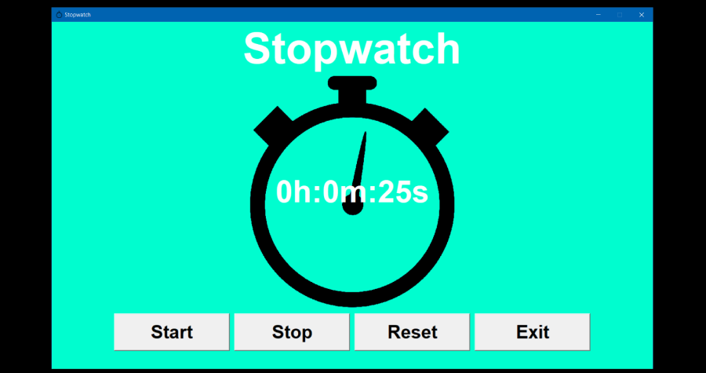

# Stopwatch
> Simple, functional stopwatch with Python.
> 
> Tutorial coming soon!

## Table of Contents
* [General Info](#general-information)
* [Setup](#setup)
* [Features](#features)
* [Screenshots](#screenshots)
* [Project Status](#project-status)
* [Acknowledgements & Tutorial](#acknowledgements)
* [Contact](#contact)

## General Information
- This project is just a basic, beginner level Python project that anyone can attempt/follow to learn or practice their coding skills.
- It is a functional stopwatch with the features stated in the [section below](#features).
- I created this project out of boredom and I plan to upload a tutorial on it if I have not already!

## Setup
This project uses only a few Python modules and libraries.

*These are the installations required:*

    pip install pillow

## Features
Basic stopwatch functions.
- Start, stop, reset and exit buttons to control the stopwatch.
- Elapsed time is shown in real-time.
- Option to resume or reset, after the stopwatch is stopped.

## Screenshots

## Project Status
Project is: complete, but may have future amendments in order to improve the project.

## Acknowledgements
Credits
- This project was created by Zeeshan Ibrahim (CodeZee)
- [Here](https://www.example.com) is the tutorial for the project.

## Contact
Created by [@CodeZee](https://www.example.com) - feel free to contact me!
